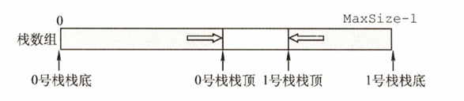
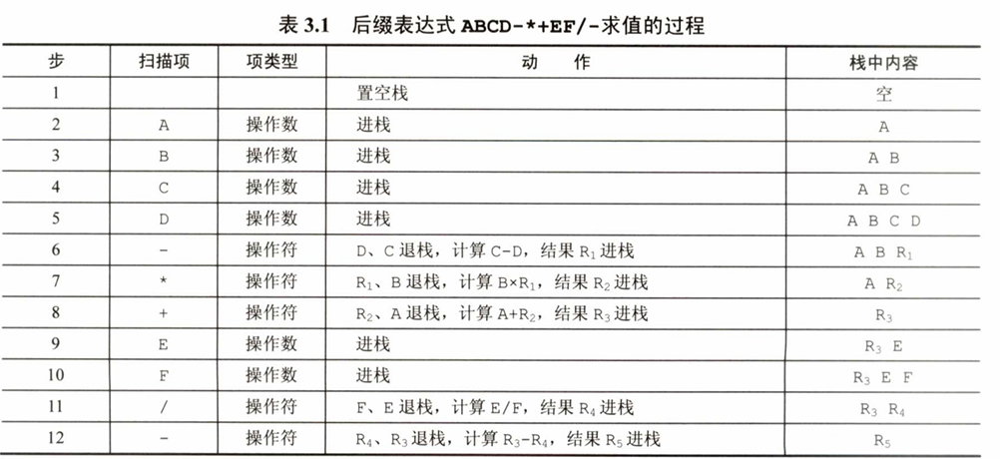

# 栈
定义：只允许在一端进行插入或删除操作的 **线性表**
`n个不同元素进栈，出战元素不同排列个数为`$\frac{1}{n+1}C_{2n}^n$
#### 顺序存储结构体
```
#define MaxSize 50           //定义栈中元素的最大个数
typedef struct{
	Elemtype data[MaxSize];  //存放栈中元素
	int top;                 //栈顶元素
}SqStack;
```
`后进先出（Last In First Out，LIFO）`
#### 基本操作
+ InitStack(&S):初始化空栈
+ StackEmpty(S):判断栈是否为空，空返回true
+ Push(&S,x)：进栈，若栈S未满，则将x加入使之成为新栈顶。
+ Pop(&S,&x)：岀栈，若栈S非空，则弹出栈顶元素，并用x返回。
+ GetTop (S, &x):读栈顶元素，若栈S非空，则用x返回栈顶元素。
+ DestroyStack(&S)：销毁栈，并释放栈S占用的存储空间
#### 共享栈
让两个顺序栈共享一个一维数组空间，将两个栈的栈底分别设置在共享空间的两端，两个栈顶向共享空间的中间延伸。

`共享栈是为了更有效地利用存储空间，两个栈的空间相互调节，只有在整个存储空间被占满 时才发生上溢。`
#### 链式存储结构体
```
typedef struct LinkNode{
	ElemType data;          //数据域
	struct Linknode *next;  //指针域
}*LiStack;                  //栈类型定义
```
`链栈的优点是便于多个栈共享存储空间和提高其效率，且不存 在栈满上溢的情况。`
# 队列
定义：只允许在表的一端进行插入，而在表的另一端进行删除的线性表。
`先进先出（First In First Out，FIFO）`  
`栈和队列具有相同的逻辑结构，都是线性表。`  

#### 基本操作
+ InitQueue (&Q):初始化队列，构造一个空队列Q。
+ QueueEmpty (Q)：判队列空，若队列Q为空返回true,否则返回false。
+ EnQueue (&Q, x)：入队，若队列Q未满，将x加入，使之成为新的队尾。
+ DeQueue (&Q, &x):岀队，若队列Q非空，删除队头兀素，并用x返回。
+ GetHead(Q,&x)：读队头元素，若队列Q非空，则将队头元素赋值给x。
#### 顺序存储
```
#define MaxSize 50
typedef struct {
	ElemType data[MaxSize];  //用数组存放队列元素
	int front,rear;          //队头指针和队尾指针
}SqQueue;
```
**队列判空条件：Q.rear == Q.front == 0  但不能用Q.rear == MaxSize**
#### 循环队列
定义：存储队列元素的表从逻辑上视为一个环  
`当队首指针Q.front=MaxSize-l后，再前进一个位置就自动到0,这可以利用除法取余运算(％)来实现。`
队空条件：Q.front == Q.rear
判断队空还是队满的处理方式：
+ 牺牲一个单元来区分队空和队满，入队时少用一个队列单元，这是一种较为普遍的做法, 约定以“队头指针在队尾指针的下一位置作为队满的标志”
    + 队满条件：(Q. rear+1) %MaxSize == Q. fro nt。
    + 队空条件仍：Q. front == Q.rear。
    + 队列中元素的个数：(Q. rear-Q.front+MaxSize) % MaxSize。
+ 类型中增设表示元素个数的数据成员。这样，队空的条件为Q. size== 0；队满的条件为 Q. size == MaxSize。这两种情况都有 Q. front == Q.rear。
+ 类型中增设tag数据成员，以区分是队满还是队空。tag等于0时，若因删除导致 Q. front == Q. rear,则为队空；tag等于1时，若因插入导致Q. front == Q. rear, 则为队满。
#### 链式存储
```
typedef struct LinkNode{  //链式队列结点
	ElemType data;
	struct LinkNode *next;
}LinkNode;
typedef struct {            //链式队列
	LinkNOde *front,*rear;  //队列的对头和队尾指针
}LinkQueue;
```
`用单链表表示的链式队列特别适合于数据元素变动比较 大的情形，而且不存在队列满且产生溢出的问题。`
#### 双端队列
定义：允许两端都可以进行入队和出队操作的队列。其元素的逻辑结构仍是线性结构。将队列的两端分别称为前端和后端，两端都可以入队和出队。
+ 输出受限的双端队列：允许在一端进行插入和删除，但在另一端只允许插入的双端队列称为 输出受限的双端队列；
+ 输入受限的双端队列：允许在一端进行插入和删除，但在另一端只允许删除的双端队列称为 输入受限的双端队列
# 栈的括号匹配应用
算法思路：
1. 初始设置一个空栈，顺序读入括号。
2. 若是左括号，则存入栈中；
3. 若是右括号，则先检查栈顶的括号是否于其匹配，若匹配，则弹栈；若不匹配，直接输出不合法；直到栈空。
# 栈在表达式求值中的应用
基本思路：先将中缀表达式转换为后缀表达式，再对后缀表达式求值。
## 中缀表达式转后缀表达式
1. 初始两个栈，一个栈op用于存储运算符号，一个栈存储后缀表达式
2. 遍历中缀表达式
	1. 遇到操作符，直接存入后缀表达式栈中；
	2. 遇到括号界限符，左括号直接加入操作符栈中，遇到右括号将操作符栈中的左括号以上的运算符依次弹出至后缀表达式栈中；
	3. 遇到操作符，比对栈顶运算符，如若栈顶运算符优先级更高（除括号界限符），则从栈顶开始，依此弹出栈中优先级高于或等于当前运算符的所有运算符至后缀表达式栈中，再将该运算符压入后缀表达式栈中；否则直接该运算符压入后缀表达式栈中。

|         待处理序列 | op栈   | 后缀表达式        | 扫描项 | 操作说明                      |
| ------------: | ----- | ------------ | --- | ------------------------- |
| A+B*(C-D)-E/F |       |              | A   | A加入中缀表达式                  |
|  +B*(C-D)-E/F |       | A            | +   | +压入op栈                    |
|   B*(C-D)-E/F | +     | A            | B   | B加入中缀表达式                  |
|   \*(C-D)-E/F | +     | AB           | *   | \*优先级高于栈顶，* 压入op栈         |
|     (C-D)-E/F | +\*(  | AB           | (   | (直接入栈                     |
|      C-D)-E/F | +\*(  | AB           | C   | C加入中缀表达式                  |
|       -D)-E/F | +\*(  | ABC          | -   | 栈顶为(,-压入op栈               |
|        D)-E/F | +\*(- | ABC          | D   | D加入中缀表达式                  |
|         )-E/F | +\*(- | ABCD         | )   | 遇到)，弹出-，删除(               |
|          -E/F | +\*   | ABCD-        | -   | -优先级低于栈顶，依此弹出*、+，-加入中缀表达式 |
|           E/F | -     | ABCD-\*+     | E   | E加入中缀表达式                  |
|            /F | -     | ABCD-\*+E    | /   | /优先级高于栈顶，/压入op栈           |
|             F | -/    | ABCD-\*+E    | F   | F加入中缀表达式                  |
|               | -/    | ABCD-\*+EF   |     | 扫描完毕，弹出op栈中所有元素           |
|               |       | ABCD-\*+EF/- |     | 结束                        |
## 后缀表达式求值

`队列在计算机系统的作用：第一个方面是解决主机与外部设备之间速度不匹配的问题，第二个方面是解决由多用户引起的资源竞争问题。`
# 数组