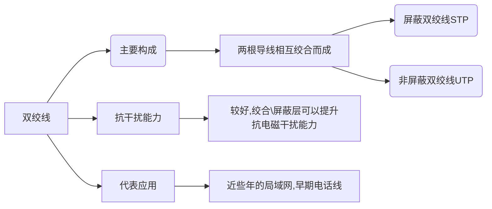

任务：实现相邻节点之间的比特（0或1）的传输
## 通信基础
+ 信源：信号的来源  
+ 信宿：信号的“归宿”
+ 数据：信息的实体
+ 信道：信号的通道  
+ 信号：
	+ 数字信号：离散的
	+ 模拟信号：连续的
+ 码元：对应一种信号 **1码元=$log_{2}K$bit**
+ 码元宽度：信号周期
+ 波特率：每秒钟传输的码元数码元/秒
## 信道的极限容量
奈奎斯特定理：***对于一个理想低通信道（没有噪声、带宽有限的信道）*** 极限波特率=2W（波特即码元/秒）即**极限波特率=$2Wlog_{2}K$**【W为带宽】  
+ 如果波特率太高，会导致“码间串扰”，即接收方无法识别码元
+ 带宽越大，信道传输码元的能力越强
+ 并未对一个码元最多可以携带多少比特做出解释

香农定理：***对于一个有噪声、带宽有限的信道***，极限比特率=W$log_{2}(1+\frac{S}{N})$  (b/s)
信噪比=S/N=$\frac{噪声的功率}{信号的功率}$=10$log_{10}S/N$(db分贝)
+ 提升信道带宽、加强信号功率、降低噪声功率，都可以提高信道的极限比特率
+ 在带宽、信噪比确定的信道上，一个码元可以携带的比特数是有上限的
## 编码与调制
### 数据编码转换为数字信号（编码）
+ 不归零编码（NRZ）：低0高1，中不变（没有自同步能力，不浪费带宽，抗干扰能力弱）
+ 归零编码（RZ）：低0高1，中归0（有自同步能力，浪费带宽，抗干扰能力弱）
+ 反向非归零编码（NRZI）：跳0不跳1看起点，中不变（若增加冗余位，可支持自同步，会浪费一点带宽，抗干扰能力弱）
+ 曼彻斯特编码：跳0反跳1看中间，中必变（有自同步能力，浪费带宽，抗干扰能力强） *以太网常用曼彻斯特编码*
+ 差分曼彻斯特编码：跳0不跳1看起点，中必变 （有自同步能力，浪费带宽，抗干扰能力强）
### 数字数据转换为模拟信号（调制）
+ 调幅（AM或ASK）：通过改变载波的振幅来表示数字0或1
+ 调频（FM或FSK）：通过改变载波的频率来表示数字信号1和0
+ 调相（PM或PSK）：通过改变载波的相位来表示数字1和0
+ 正交幅度调制（QAM）：在频率相同的前提下，将AM与PM结合起来，形成叠加信号。设波特率为B，采用m个相位，每个相位有n种振幅则数据传输速率R为$R=Blog_{2}mn$

