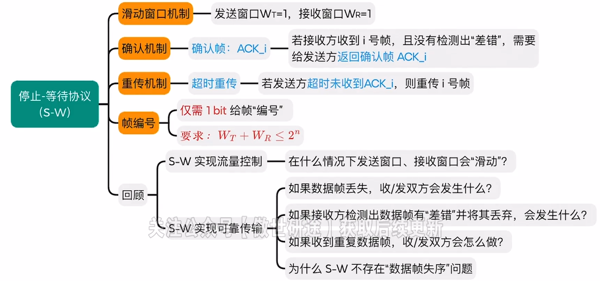
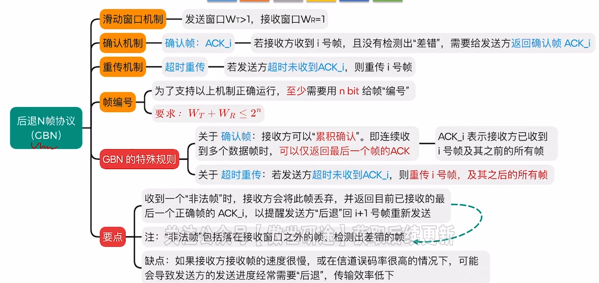
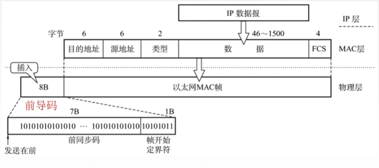
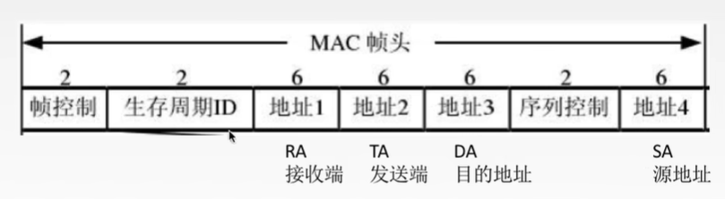
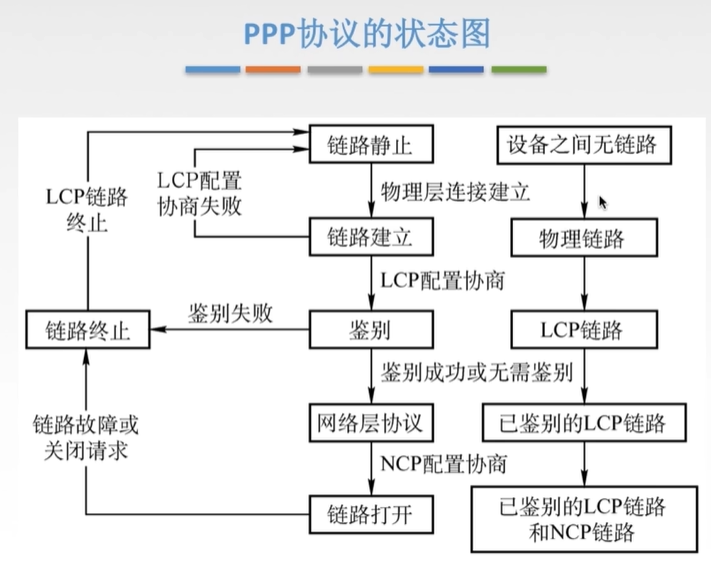

数据链路层使用“物理层”提供的“比特传输”服务  
数据链路层为网络层提供服务，将网络层的IP数据报（分组）封装成帧，传输给下一个相邻节点    
**物理链路**：传输介质（0层）+物理层（1层）实现了相邻节点之间的“物理链路”  
**逻辑链路**：数据链路层需要基于“物理链路”，实现相邻结点之间逻辑上无差错的“数据链路”  

---
# 功能
+ 封装成帧：
	+ 帧定界：如何让接收方能够确定帧的界限
	+ 透明传输：接收方链路层要能从收到的帧内恢复原始SDU，让网络层“感受不到”将分组封装成帧的过程
+ 差错控制：发现并解决一个帧内部的“位错”
	+ 解决方案一：接收方发现比特错后丢弃帧，发送方重传帧（仅需采用检错编码）
	+ 解决方案二：由接收方发现并纠正比特错误（需采用纠错编码）
+ 可靠传输：发现并解决“帧错”（帧丢失、帧重复、帧失序）
+ 流量控制：控制发送方发送帧的速率别太快，让接收方“来得及”接受
+ 介质访问控制：
	+ “广播信道”需要实现此功能。广播信道在逻辑上是总线型拓扑，多个结点需争抢传输介质的使用权
	+ “点对点信道”通常不需要实现此功能。点对点信道通常意味着两个节点之间有专属介质，不用抢
---
# 组帧
+ 字符计数法：在每个帧开头，用一个定长计数字段表示帧长
	+ 缺点：任何一个技术字段出错，都会导致后续所有帧无法定界
+ 字节填充法：使用SOH和EOT控制字符表示一帧的开始与结束，通常会使用ESC转义字符避免帧中出现控制字符导致扫描出错。
+ 零比特填充法（HDLC、PPP）：使用比特串01111110来标志一帧的开始和结束
	+ 发送方需要对帧的数据部分进行处理，*每当遇到5个1，就填充一个0*
	+ 接收方需要对帧的数据部分进行逆处理，*每当遇到连续5个1，就删掉后面的0*
+ 违规编码法：需要物理层配合，对采用的信号传输方式使用违规的信号编码，例如基于曼彻斯特码，每一个信号是观察信号是否跳变，当信号不进行跳变时则“违规”，将其表示帧的开始或结束
---
# 差错控制
### 奇偶校验码
奇（偶）校验码：整个校验码（有效信息为何校验位）中“1”的个数为奇（偶）数    
奇校验：检查信息位中“1”的个数为偶数则校验位为1，为奇数则检验位为0（偶校验相反）  
偶校验的硬件实现：各信息进行异或运算，得到的结果即为偶校验位  
缺点：只能检测奇数位出现错误的情况，并且不知道哪些位出错
### 循环冗余码（CRC）
思想：数据发送、接收方约定为一个“除数”，K个信息位+R个校验位作为“被除数”，添加校验位后需保证出发的余数为0，然后接收方进行除法检测余数是否为0，非0即需要重传或者纠错  
基本思想：
1. 收发双方约定生成多项式G(x)（最高位和最低位必须为1），k位位串可视为阶数为k-1的多项式的系数序列。例如，可用多项式$x^3+x^2+1$表示位串1101
2. 发送方基于待发送的数据和G(x)，计算冗余码，将冗余码附加到数据后面一起发送
3. 接收方收到数据和冗余码后，通过G(x)来计算收到的数据和冗余码是否产生差错

检错能力：
+ 可检测出所有格奇数个错误
+ 可检测出所有双比特的错误
+ 可检测出所有小于等于检验位长度的连续错误
+ 若选择合适的生成多项式，且$2^R\geq K+R+1$,则可纠正单比特错误
### 海明校验码
1. 确定海明码位数：n为有效信息位数，k为校验位的位数，则信息位n和校验位k应满足$n+k+1\leq2^k-1$
2. 确定校验位的分布，校验位$P_i$放在海明位号为$2^{i-1}$的位置上，信息位按顺序放到其余位置
3. 分组以形成校验关系：被检验数据位的海明位号等于检验该数据位的各检验位海明位号之和
4. 检验位取值：检验位$P_i$的值为第i组所有位求异或
5. 构造校验方程：G1 = P1 ⊕ D1 ⊕ D2 ⊕ D4 ；G2 = P2 ⊕ D1 ⊕ D3 ⊕ D4；G3 = P3 ⊕ D2 ⊕ D3 ⊕ D4等，最后由“G3G2G1”的值进行判断，若为“000”，则正确，若为“001”，则第一位发生了错误

综上所述，海明码纠错能力只有1位，检错能力可以检错2位    
海明码“纠错”d位，需要码距2d+1的编码方案；“检错”d位，则只需码距为d+1  

---
# 流量控制与可靠传输机制
$W_T+W_R\leq2^n$  
## 停止等待协议（S-W）
原理：发送方每次只允许发送一个帧，接收方每接收一个帧都要反馈一个应答信号，表示可以接受下一帧，发送方收到应答信号后才能发送下一帧。若发送方没有收到接收方反馈的应答信号，则需要一直等待。发送方每发送完一个帧，就进入等待接收方确认信息的过程中，因而传输效率很低。  

## 后退N帧协议（GBN）
在后退N帧协议中，发送方可在为收到确认帧的情况下，将序号在发送窗口内的多个数据帧全部发送出去。后退N帧的含义是：发送方发送N个数据帧后，若发现这N个帧的前一个数据帧在计时器超时的时候仍未收到其确认信息，则该帧被判为出错或丢失，此时发送方不得不重传该出错帧及随后的N个帧

## 选择重传协议（SR）
选择重传协议：用于在不可靠的网络中进行可靠数据传输。它允许发送方同时发送多个数据包，并在接收方接收到这些数据包后进行选择性的重传。只有丢失或损坏的数据包会被重新传输，而不需要重新传输整个数据流。`存在帧缓冲区，用于维持帧的顺序位次`  
1. 发送方将数据分成多个数据包，并分配唯一的序列号给每个数据包。
2. 发送方将这些数据包发送到接收方。
3. 接收方接收数据包，并根据序列号将它们按顺序重组。
4. 如果接收方检测到有丢失或损坏的数据包，它会向发送方发送一个选择性重传请求，请求重新发送仅丢失或损坏的数据包。
5. 发送方收到选择性重传请求后，仅重新发送被请求的数据包。
6. 这个过程不断重复，直到接收方成功接收所有数据包。

---
# 信道划分介质访问控制
信道划分介质访问控制（MAC）：  将使用介质的每个设备与来自同一信道上的其他设备的通信隔离开，把时域和频域资源合理地分配给网路上的设备。  
多路复用技术：把多个信号组合在一条物理信道上进行传输，使得多个计算机或终端设备共享信道资源，提高信道利用率。  
分用：把一条广播信道，逻辑上分成几条用于两个节点之间通信的互不干扰的子信道，实际就是把广播信道转变为点对点信道。  
## 频分多路复用（FDM）
用户在分配到一定的频带后，在通信过程中自始至终都占用这个频带。频分复用的所有用户在同样的时间占用不同的带宽资源。  
优点：充分利用传输介质带宽，系统效率较高；由于技术比较成熟，实现也比较容易。  
## 时分多路复用（TDM）
将时间划分为一段段等长的时分复用帧。每一个时分复用的用户在每一个TDM帧中占用固定序号的时隙，所有用户轮流占用信道。  
统计时分复用（STDM）：每一个STDM帧中的时隙数小于连接在集中器上的用户数。各用户有了数据就随时发往集中器的输入缓存，然后集中按顺序依次扫描输入缓存，把缓存中的输入数据放入STDM帧中，一个STDM帧满了就可以发出。STDM帧不是固定分配时隙，而是按需动态分配时隙。  
## 波分多路复用（WDM）
光的频分多路复用，在一根光纤中传输多种不同波长的光信号，由于波长不同，所以各路光信号互不干扰，最后再用波长分解复用器将各路波长分解出来。  
## 码分多路复用（CDM）
码分多址（CDMA）：1个比特分为多个码片，每一个站点被指定一个唯一的m位的芯片序列。
1. 多个站点同时发送数据的时候，要求各个站点芯片序列相互正交，规格化内积为0.     $S·T=\frac{1}{m}\sum_{i=1}^{m}S_iT_i=0$
2. 两个向量到了公共信道，线性相加。  S-T
3. 数据分离：合并的数据和源站规格化内积$S·(S-T)=1 \ T·(S-T)=1$
---
# 随机访问介质访问控制
## ALOHA协议
纯ALOHA协议：不监听信道，不按时间槽发送，随机重发（如果发生冲突，接收方就会检测出差错，然后不予确认，发送方在一定时间内收不到就判断发生冲突，超时后等一随机时间在重传）  
时隙ALOHA协议：把时间分成若干个相同的时间片，所有用户在时间片开始时刻同步接入网络信道，若发生冲突，则必须等到下一个时间片开始时刻再发送
+ 纯ALOHA比时隙ALOHA吞吐量更低，效率更低
+ 纯ALOHA想发就发，时隙ALOHA只有在时间片段开始时才能发
## CSMA协议
CS：载波监听，每一个站在发送数据之前以及发送数据时要检测一下总线上是否有其他计算机在发送数据。  
MA：多点接入，表示许多计算机以多点接入的方式连接在一根总线。  
CSMA思想：`发送帧之前，监听信道`
+ 1-坚持CSMA：如果一个主机要发送消息，那么它先监听信道，空闲则直接传输，不必等待；忙则一直监听，知道空闲马上传输。如果有冲突，则等待一个随机长的时间监听，重复上述过程。
	+ 优点：只要媒体空闲，站点就马上发送，避免了媒体利用率的损失。
	+ 假如有两个或两个以上的站点有数据要发送，冲突就不可避免。
+ 非坚持CSMA：如果一个主机要发送消息，那么它先监听信道，空闲则直接传输，不必等待；忙则等待一个随机时间之后再进行监听
	+ 优点：采用随机的重发延迟时间可以减少冲突发生的可能性。
	+ 缺点：可能存在大家都在延迟等待过程中，使得媒体仍可能处于空闲状态，媒体使用率降低。
+ p-坚持CSMA：如果一个主机要发送消息，那么它先监听信道，空闲则以p概率直接传输，不必等待；概率1-p等待到下一个时间槽在传输；忙则持续监听知道信道空闲再以p概率发送。若冲突则等到下一个时间槽开始在监听并重复上述过程。
	+ 优点：既能像非坚持算法那样减少冲突，又能像1-坚持算法那样减少媒体空闲时间
	+ 缺点：发生冲突后还是要坚持把数据帧发送完，造成了浪费。
## CSMA/CD（以太网）
CD：碰撞检测，“边发送边监听”，适配器边发送数据边检测信道上信号电压的变化情况，以便判断自己在发送数据时其他站是否也在发送数据。（半双工网络）  
争用期：以太网的端到端往返时间2t  
截断二进制指数规避算法：
1. 确定基本退避时间为争用期2t
2. 定义参数k为重传次数，但k不超过10，即k=min【重传次数，10】.
3. 从离散的整数集合【0，1，···，$2^k-1$】中随机取出一个数r，重传所需要退避的时间就是r倍的基本退避时间，即2rt
4. 当重传达16次仍不能成功时，说明网络太拥挤，认为此帧永远无法正确发出，抛弃此帧并向高层报告出错
**最小帧长问题：帧的传输时延至少要两倍于信号在总线中的传播时延（最小帧长=总线传播时延\*数据传输速率\*2）,以太网规定最短帧长为64B**
## CSMA/CA（无线局域网）
工作原理：
+ 发送数据前，先检测信道是否空闲。
+ 空闲则发出**RTS**，RTS包括发射端的地址、接收端的地址、下一份数据将持续发送的时间等信息；信道忙则等待。
+ 接收端收到RTS，将响应**CTS**。
+ 发送端收到CTS后，开始发送数据帧（同时**预约信道**：发送方告知其他站点自己要传多久数据）
+ 接收端收到数据帧后，将用CRC来检验数据是否正确，正确则响应**ACK帧**
+ 发送方收到ACK就可以及逆行下一个数据帧的发送，若没有则一直重传至规定重发次数为止（采用二进制指数退避算法来确定随机的推迟时间）
---
# 轮询访问介质
信道划分介质访问控制（MAC）：
+ 基于多路复用技术划分资源
+ 网络负载重：共享信道效率高，且公平
+ 网络负载轻：共享信道效率低
随机访问MAC：
+ 用户根据意愿随机发送信息，发送信息时可独占信道带宽
+ 网络负载重：产生冲突开销
+ 网络负载轻：共享信道效率高，单个节点可利用信道全部带宽
轮询访问MAC协议：
+ 既要不产生冲突，又要发送时占全部带宽。
## 轮询协议
主节点轮流“邀请”从属结点发送数据
## 令牌传递协议（物理星型拓扑，逻辑环形拓扑）
令牌：一个特殊格式的MAC控制帧，不含任何信息。控制信道使用，确保同一时刻只有一个结点独占信道。  
*常用于负载较大、通信量较大的网络中*  

---
# 局域网
简称LAN，是指在某一区域内由多台计算机互联成的计算机组，使用广播信道。
1. 覆盖的地理范围较小，只在一个相对独立的局部范围内联
2. 使用专门铺设的传输介质进行联网，数据传输速率高
3. 通信延迟时间短，误码率低，可靠性较高
4. 各站为平等关系，共享传输信道
5. 多采用分布式控制和广播式通信，能进行广播和组播
## 拓扑结构
主要存在：星型拓扑、总线型拓扑、环形拓扑、树型拓扑
+ 星型：传输速度快、便于控制和管理但网络可靠性低、网络共享能力差，有单点故障问题
+ 总线型：可靠性高、网络节点响应速度快、共享资源能力强、设备投入量少、成本低、安装使用方便
+ 环形：通信设备和线路比较节省，有单点故障问题，系统响应延时长，信息传输效率低
+ 树型：易于拓展、易于隔离故障、容易单点故障
## 介质访问控制方法
1. CSMA/CD：常用于总线型局域网，也用于树型网络
2. 令牌总线：常用于总线型局域网，也用于树型网络。把总线型或树型网络中的各个工作站按一定顺序如按接口地址大小排列形成一个逻辑环。只有令牌持有者才能控制总线，才有发送信息的权力。
3. 令牌环：用于环形局域网，如令牌环网
## 分类
1. 以太网：IEEE802.3
2. 令牌环网：物理上是星型拓扑结构，逻辑上是环形拓扑结构（IEEE802.5）
3. FDDI网：物理上采用了双环拓扑结构，逻辑上是环形拓扑结构
4. ATM网：较新型的单元交换技术，使用53字节固定长度的单元进行交换
5. 无线局域网：采用IEEE802.11标准
### 以太网
提供无连接、不可靠的服务。**只实现无差错接受，不实现可靠传输**    
*以太网参考模型一般只包括物理层和数据链路层（网卡实现的主要功能在物理层和数据链路层）*    
10BASE-T是传送基带信号的双绞线以太网，T表示双绞线，传输速率是10Mb/s，**采用曼彻斯特编码，采用CSMA/CD**  
MAC地址：每个适配器有一个全球唯一的48位二进制地址，前24位代表厂家，后24位厂家自己制定  
以太网V2MAC帧：  
  
高速以太网：100BASE-T以太网（全双工、半双工）、吉比特以太网（使用光纤传输、全双工、半双工）、10吉比特以太网  
快速以太网仍然使用CSMA/CD协议，采用保持最短帧长不变而将最大电缆长度减少提高数据传输速率
### 无线局域网
802.11的MAC帧头格式：

+ 有固定基础设施无线局域网
+ 无固定基础设施无线局域网的自组织网络
## MAC子层和LLC子层
IEEE802将数据链路层划分为逻辑链路层LLC子层和介质访问控制MAC子层  
LLC：负责识别网络层协议，然后对他们进行封装。  
MAC：数据帧的封装/卸装，帧的寻址和识别，真的接受与发送，链路的管理，帧的差错控制等。  
## VLAN
传统局域网的局限：
+ 缺乏流量隔离：即使把组流量局域划到一个单一交换机，广播流量仍会跨越整个机构网络
+ 管理用户不便：如果一个主机在不同组件移动，必须改变物理布线，连接到新的交换机上。
+ 路由器成本较高：局域网内使用很多路由器花销较大

定义：VLAN是一种将局域网内的设备划分成与物理位置无关的逻辑组的局域网。每个VLAN是一个单独的广播域。    
交换机上生成的各VLAN互不相通，若想实现通信，需要借助路由器、三层交换机。  
VLAN标记的前两个字节表明是IEEE802.1Q帧，接下来4位没用，后面12位是VLAN标识符VID，唯一表示了该以太网帧属于哪个VLAN
+ VID的取值范围是0~4095，表示VLAN的有效ID取值范围为1~4094
+ IEEE802.1Q帧是由交换机来处理的，而不是由用户主机来处理的（即主机和交换机之间酯交换普通的以太网帧）
# 广域网
通常跨接很大的物理范围，所覆盖的范围从几十公里到几千公里，可以形成国际性的远程网络。  
广域网的通信子网主要使用**分组交换**技术，广域网的通信子网可以利用公用分组交换网、卫星通信网和无限分组交换网，他将分布在不同地区的局域网或计算机系统互连起来，实现存储转发，达到**资源共享**的目的。
## PPP协议
只支持全双工链路，提供有连接不可靠服务  
+ 简单：对于链路层的帧，无需纠错，无需序号，无需流量控制
+ 封装成帧：帧定界符
+ 透明传输：与帧定界符一样比特组合的数据应该如何处理：异步线路用字节填充，同步线路用比特填充
+ 多种网络层协议：封装的IP数据报可以采用多种协议
+ 多种类型链路：串行/并行，同步/异步，电/光
+ 差错检测
+ 检测连接状态
+ 最大传送单元
+ 网络层地址协商
+ 数据压缩协商
无需满足的要求：
+ 纠错
+ 流量控制
+ 序号
+ 不支持多点线路
三个组成部分：
+ 一个将IP数据报封装到串行链路的方法
+ 链路控制协议LCP：建立并维护数据链路连接
+ 网络控制协议NCP：PPP可支持多种网络层协议，每个不同的网络层协议都要一个相应的NCP来配置，为网络层协议建立和配置逻辑连接

| 设备名称 | 能否隔离冲突域 | 能否隔离广播域 |
| :--: | :-----: | :-----: |
| 集线器  |   不能    |   不能    |
| 中继器  |   不能    |   不能    |
| 交换机  |    能    |   不能    |
|  网桥  |    能    |   不能    |
| 路由器  |    能    |    能    |

