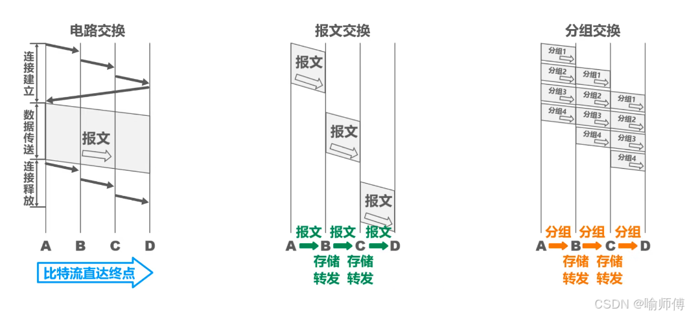

**计算机网络**：是一个将众多分散的、自治的计算机系统，通过通信设备与线路连接，有功能完整的软件实现资源共享和信息传递的系统。  
**互连网**：可以把两个或多个计算机网络互相连接起来，形成更大的计算机网络。`任意协议`  
**互联网（Internet）**：由各大ISP（Internet Service Provider）和国际机构组建的，覆盖全球范围的互连网。`TCP/IP协议`    
`家用路由器=路由器+交换机+其他功能`
## 计算机网络组成
+ 从组成部分来看：
    + 硬件：
	    + 主机
	    + 通信链路
	    + 交互设备
	    + 通信处理机
	    + ······
	+ 软件：方便用户使用，实现资源共享
	+ 协议：规定了计算机网络中的通信规则，由硬件、软件共同实现。
+ 从工作方式来看：
	+ 边缘部分：
		+ 工作方式：直接为用户服务
		+ 主要由连接到互联网上的主机及其软件组成
	+ 核心部分：
		+ 工作方式：为边缘部分提供服务
		+ 由大量网络和连接这些网络的路由器组成
+ 从逻辑功能来看：
	+ 通信子网：
		+ 计算机网络中负责计算机间信息信息传输的部分。即把计算机和其他用户装置互联在一起的所有通信设备和介质的总称
		+ 主要由通信链路+通信设备+协议构成
	+ 资源子网：
		+ 计算机网络运行应用程序，向用户提供可共享的硬件、软件和信息资源的部分
		+ 主要由连接到互联网上的主机组成
## 计算机网络的功能
+ 资源共享：
	+ 硬件资源共享
	+ 软件资源共享
	+ 数据资源共享
+ 数据通信：实现计算机之间的数据传输。*最基本最重要的功能*
+ 分布式处理：将某个复杂任务分配给网络中多台计算机处理
+ 提高可靠性：网络中各台计算机互为替代机
+ 负载均衡：将工作任务均衡地分配给计算机网络中的各台计算机
+ 还可以实现电子化办公与服务、远程教育、娱乐等功能
## 电路交换、报文交换与分组交换
**电路交换**：通过物理线路的连接，动态地分配传输线路资源
优点：
+ 通信钱从主叫端到被叫端建立一条专用的物理线路，在通信的全部时间内，两个用户始终占用端到端的线路资源。数据直送，传输速率高。`更适用于：低频次、大量地传输数据`
缺点：
+ 建立/释放连接，需要额外的时间开销
+ 线路被通信双方独占，利用率低
+ 线路分配的灵活性差
+ 交换节点不支持“差错控制”（无法发现传输过程中发生的数据错误）
**报文交换**：存储转发交换
优点：
+ 通信前无需建立连接
+ 数据以“报文”为单元被交换节点间“存储转发”，通信线路可以灵活分配
+ 在通信时间内，两个用户无需独占一整条物理线路。相比于电路交换，线路利用率高
+ 支持“差错控制”（通过校验技术）
缺点：
+ 报文不定长，不方便存储管理
+ 长报文的·存储转发时间开销大、缓存开销大
+ 长报文容易出错，重传的代价高
**分组交换**：将用户的信息划分为一定长度的数据分组，然后在分组数据上加上控制信息和地址，然后经过分组交换机发送到目的地址。
优点：
+ 通信前无需建立连接
+ 数据以“分组”为单元被交换结点间“存储转发”，通信线路可以灵活分配
+ 在通信时间内，两个用户无需独占一整条物理线路。相比于电路交换，线路利用率高
+ 支持“差错控制”（通过校验技术）
改进问题：（相对于报文交换）
+ 分组定长，方便存储转发管理
+ 分组的存储转发时间开销小、缓存开销小
+ 分组不易出错、重传代价低
缺点：
+ 控制信息占比增加（）
+ 存在转发时延
+ 报文被拆分成多个分组，传输过程中可能出现失序、丢失等问题，增加处理的复杂度

|             | 电路交换 | 报文交换交换 | 分组交换        |
| ----------- | ---- | ------ | ----------- |
| 完成传输所需时间    | 最少   | 最多     | 较少          |
| 存储转发时延      | 无    | 较高     | 较低          |
| 通信前是否需要建立连接 | 是    | 否      | 否           |
| 缓存开销        | 无    | 高      | 低           |
| 是否支持差错控制    | 不支持  | 支持     | 支持          |
| 报文数据是否有序到达  | 是    | 是      | 否           |
| 是否需要额外的控制信息 | 否    | 是      | 是（控制信息占比较大） |
| 线路分配的灵活性    | 不灵活  | 灵活     | 非常灵活        |
| 线路利用率       | 低    | 高      | 非常高         |
## 计算机网路的分类
+ 按分布范围分类：
	+ 广域网（WAN）：一般跨国跨省
	+ 城域网（MAN）：跨城市，常采用“以太网技术”
	+ 局域网（LAN）：跨学校/企业/工作单位/家庭，**“以太网技术”**
	+ 个域网（PAN）：个人家庭使用，经常被称为“无线个域网”
+ 按传输技术分类：
	+ 广播式网络：当一台计算机发送数据分组时，广播范围内所有计算机都会收到该分组，并通过检查分组的目的地址决定是否接受该分组
	+ 点对点网络：数据只会从发送方“点对点”发到接收方，精准送达
+ 按拓扑结构：
	+ 总线型结构：数据”广播式“传输；存在”总线争用“
	+ 环形结构：数据”广播式“传输；通过”令牌“解决总线争用问题，令牌顺环形依次传递，拿到令牌者可使用总线
	+ 星型结构：由中央设备实现数据的”点对点“传输，不存在”总线争用“问题
	+ 网状结构：数据通过各中间节点逐一存储转发，属于”点到点“传输，常见于”广域网“，灵活、可靠性高但是复杂性也高
+ 按使用者分类：
	+ 公用网：向公众开放的网络
	+ 专用网：仅供某个组织内部使用的网络
+ 按传输介质分类：有线网络、无线网络
## 计算机网络的性能指标
### 速率
定义：指连接到网络上的节点在信道上传输数据的速率。也称**数据率或比特率、数据传输速率**
单位：bits/s,b/s或者bps（比特每秒）(1B = 8b)*以1000作为横跨单位*
信道：表示某一方向传送信息的通道（信道**不等于**通信线路），一条信道线路在逻辑上往往对应一条发送信道和一条接受信道  
### 带宽
定义：某信道所能传送的最高数据率（其他含义：表示某信道允许通过的信号频带范围）
单位：bps（b/s、bit/s）
### 吞吐量
定义：指单位时间内通过某个网络（或信道、接口）的实际数据量。  
吞吐量受带宽限制、受复杂的网络负载情况影响
### 时延
定义：指数据（一个报文或分组，甚至比特）从网络的一端传送到另一端所需的时间。有时也被称为延迟或迟延  
**总时延=发送时延+传播时延+处理时延+排队时延**  
传输（发送）时延：节点将数据推向信道所花时间 =$\frac{数据长度(bit)}{发送速率(bit/s)}$   
传播时延：电磁波在信道中传播一定的距离所花的时间=$\frac{信道长度（m）}{电磁波在洗脑中的传播速度（m/s）}$  
处理时延：被路由器处理所花的时间  
排队时延：数据排队进入，排队发出路由器所花的时间  
`处理时延与排队时延受网络负载、路由器性能等诸多因素影响`  
### 时延带宽积
***时延带宽积=传播时延\*带宽***  
定义：一条链路中，已从发送端发出但尚未达到接收端的最大比特数
### 往返时延
（RTT）定义：表示从发送方发送完数据，到发送方收到来自接收方的确认总共经历的时间  
  
### 信道利用率
定义：某个信道有百分之多少的时间是有数据通过的
信道利用率=$\frac{有数据通过的时间}{有数据通过的时间+没有数据通过的时间}$
`信道利用率太高说明网络拥塞；太低说明浪费资源`
## 计算机分层
ISO提出OSI参考模型（法律上的标准）：物理层、数据链路层、网络层、运输层、会话层、表示层、应用层；  
ARPANET提出TCP/IP模型：网络接口层、网际层、传输层、应用层
**教学用的模型：物理层、数据链路层、网络层、传输层、应用层**  
网络的体系结构：计算机网络的各层及其协议的集合，就是这个计算机网络及其构件所应完成的精确定义
`服务的作用方向为垂直的，协议的方向是水平的`  
协议数据单元（PDU）：对等层次之间传送的数据单位  
服务数据单元（SDU）：为完成上一层实体所要求的功能而传送的数据  
协议控制信息（PCI）：控制协议操作的信息  
n-SDU+n-PCI = n-PDU=(n-1)-SDU
协议由语法、语义和同步三部分组成  
+ 语法：数据与控制信息的格式
+ 语义：即需要发出何种控制信息、完成何种动作及做出何种应答。
+ 同步：执行各种操作的条件、时序关系等，即事件实现顺序的详细说明。
### OSI模型
物理层任务：实现相邻节点之间的比特传输    
链路层任务：确保相邻节点之间的链路逻辑上无差错（差错控制、流量控制）  
网络层任务：把”分组“从源节点转发到目的节点（路由选择、分组转发、拥塞控制、网际互联、差错控制、流量控制、连接建立与释放、可靠传输管理······）  
传输层任务：实现端到端通信（复用和分用）   
会话层任务：管理进程间会话  （会话管理）
表示层任务：解决不同主机上信息表示不一致的问题  （数据格式转换）
应用层任务：实现特定的网络应用  
 `网络层向上层提供有连接可靠的服务（虚电路）无连接不可靠服务（数据报）`  
 `OSI传输层向上提供有连接可靠的服务`
### TCP/IP模型
网络接口层：为网络层传输”分组“，*未具体描述网络接口层的功能、协议*
应用层：将OSI模型中的会话层、表示层、应用层的任务集合在应用层中
网络层：路由选择、分组转发、拥塞控制、网际互联
传输层：复用和分用、差错控制、流量控制、连接建立与释放、可靠传输管理
`网络层向上层提供无连接不可靠服务（数据报）`  
 `TCP/IP传输层向上提供有连接可靠的服务（TCP）无连接不可靠服务（UDP）`